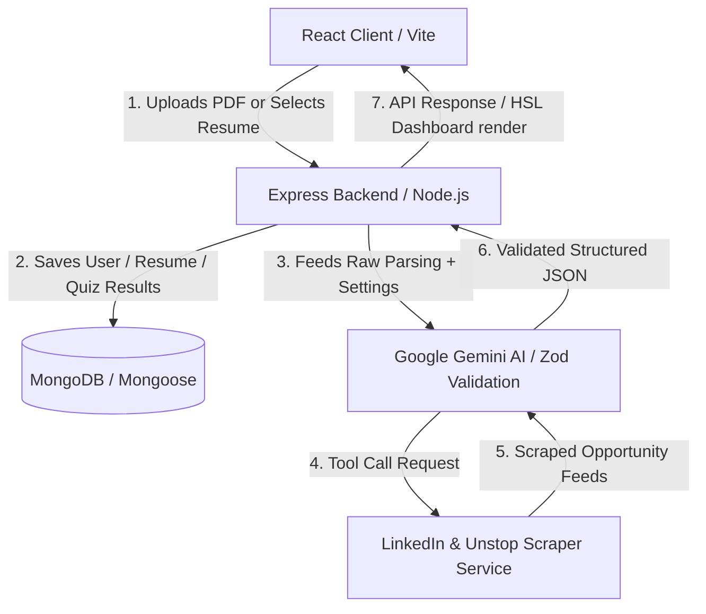

# 🚀 VidyaGuide: Agentic AI Career Coach & Resume Mentor

<div align="center">


An advanced, end-to-end **Agentic AI-powered career coach** designed to automate resume feedback, track professional skill gaps, generate custom timelines, run adaptive technical interview quizzes, and fetch matching job listings using an intelligent scraping loop.

</div>

---

## 🗺️ System Architecture

The diagram below details the data flow and integration between the Vite client, the MERN server, and the Google Gemini API agent:



---

## ✨ Core Features

### 📁 Resume Portfolio & Profile Manager
* **In-Memory PDF Parser**: Converts PDF uploads into raw text structures instantly.
* **Resume Manager Collection**: Users can drag-and-drop multiple resumes to their profile.
* **Dropdown Selection**: Generated reports can target stored profile resumes, eliminating redundant uploads.
* **Resume Maintenance**: Full dashboard to view upload histories and delete files dynamically.

### 🎯 AI Coaching Reports & Prep Roadmaps
* **Intelligent Match Score**: Instant alignment metrics (0-100%) against target job descriptions.
* **Mock Interviews**: Returns 5-7 technical questions and 3-5 behavioral questions matching candidate-intent and answers.
* **Adaptive Timelines**: Dynamic preparation timelines that scale from 7 up to 30+ days based on skill gaps.
* **Learning Badges**: Clickable video resources (🎥 YouTube) and official reference pages (📄 documentation).

### 🧠 Adaptive Interview Prep Quizzes
* **Hybrid Scope Selectors**: Launch quizzes targeting either job description history or identified skill gaps.
* **Custom Parameter Bounds**: Supports custom numeric input count (1-30 questions) and difficulty levels.
* **MCQ Game Loop**: Interactive deck showing progress bars and immediate choice checkmarks.
* **Detailed AI Explanations**: Explains the correct answer logic with Gemini-backed explanations.
* **Performance Tracker**: Score logging and past quiz history persisted in MongoDB.

### 💼 Agentic Job Discovery
* **Scraper Tool Loops**: Uses Gemini function declarations to search LinkedIn and Unstop.
* **AI Relevance Filter**: Discards unrelated profiles and filters jobs matching the search query.

---

## 📁 Repository Directory Structure

```text
├── backend/
│   ├── config/              # MongoDB ODM connections
│   ├── src/
│   │   ├── controllers/     # Authentication, reports, resumes, and quiz logic
│   │   ├── middlewares/     # JWT authentication guards and multer file handlers
│   │   ├── models/          # Mongoose database schemas
│   │   ├── routes/          # Mounted endpoints
│   │   └── services/        # Gemini AI integrations & scraper methods
│   ├── index.js             # Middleware configurations & routes binding
│   └── server.js            # Node HTTP server listener
└── frontend/
    ├── src/
    │   ├── components/      # UI components (Sidebar, Report Details)
    │   ├── pages/           # Pages (Dashboard, Profile, Quiz, Search)
    │   ├── utils/           # Client-side API fetch utilities
    │   ├── App.jsx          # Route configurations
    │   ├── index.css        # Core design system stylesheet
    │   └── main.jsx         # App bootstrap anchor
```

---

## ⚙️ Prerequisites & Environment Variables

Create a file named `.env` in the `backend` directory:

```env
# MongoDB Connection URI (Local database or Atlas Cluster)
mongo_uri=mongodb://localhost:27017/agentic-ai-resume

# Google Gemini API credential
GOOGLE_GEMINI_API_KEY=your_gemini_api_key_here

# JWT Secret key for authentication token hashing
jwt_secret=your_super_secret_jwt_key_here
```

---

## 🚀 Getting Started

Follow these steps to set up and run the application locally:

### 1. Start the Backend API
Navigate to the `backend` folder, install npm packages, and start the development server:
```bash
cd backend
npm install
npm start
```
*(The backend server will connect to MongoDB and start listening on port `3000`)*

### 2. Start the Frontend Client
Open a new terminal window, navigate to the `frontend` folder, install npm packages, and launch Vite:
```bash
cd frontend
npm install
npm run dev
```
*(The client application will start running on port `5173`)*

---

## 🔌 Core API Specifications

| Method | Endpoint | Description | Auth Required |
| :--- | :--- | :--- | :--- |
| **POST** | `/api/auth/register` | Registers a new user account | No |
| **POST** | `/api/auth/login` | Authenticates user and sets token cookie | No |
| **GET** | `/api/auth/get-me` | Validates session token and returns credentials | Yes |
| **POST** | `/api/auth/logout` | Clears local cookie and blacklists token | Yes |
| **POST** | `/api/interview/` | Generates a career report from parsed PDF upload | Yes |
| **GET** | `/api/interview/history` | Fetches historical reports generated by user | Yes |
| **GET** | `/api/resumeUpload/` | Lists metadata of user's stored resumes | Yes |
| **POST** | `/api/resumeUpload/upload` | Uploads and saves a new resume to profile | Yes |
| **DELETE**| `/api/resumeUpload/:id` | Deletes a stored resume from database | Yes |
| **POST** | `/api/quiz/generate` | Generates custom multiple-choice quiz questions | Yes |
| **POST** | `/api/quiz/submit` | Grades and saves the completed quiz score | Yes |
| **GET** | `/api/quiz/history` | Retrieves the history of completed quizzes | Yes |
| **POST** | `/api/jobs/search` | Scrapes public search opportunities agentically | Yes |

