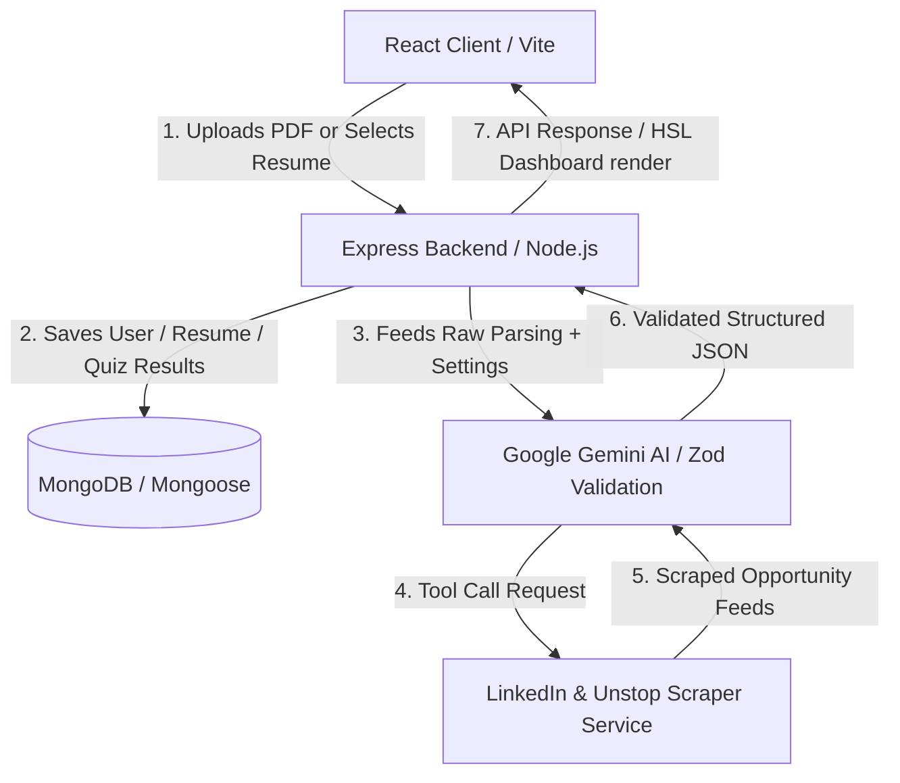
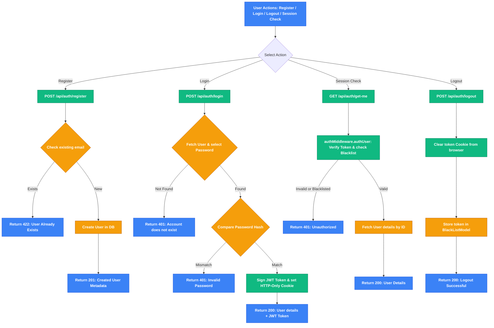
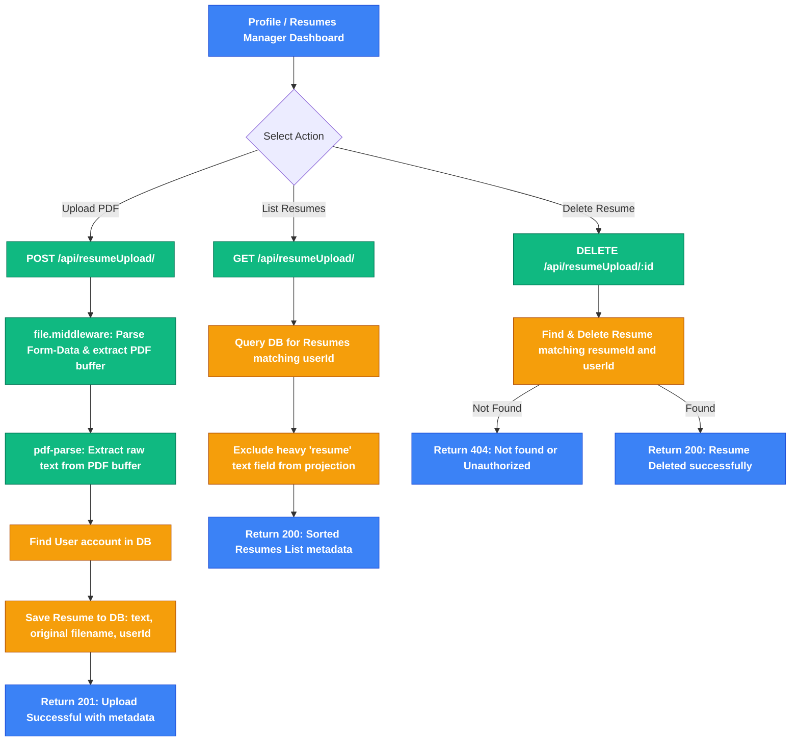
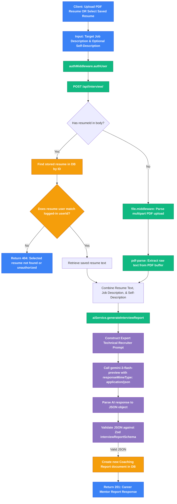
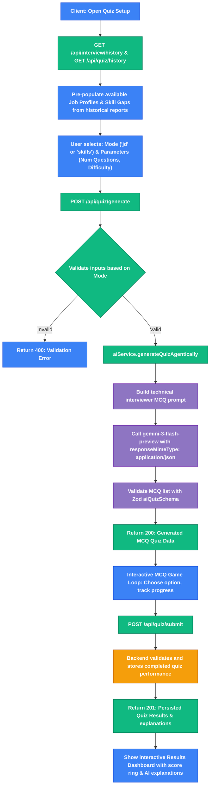
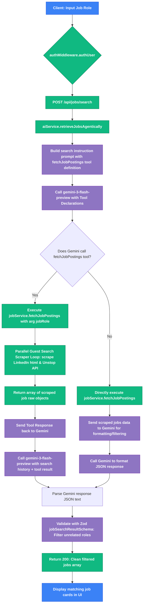

# 🚀 VidyaGuide: Agentic AI Career Coach & Resume Mentor

<div align="center">


An advanced, end-to-end **Agentic AI-powered career coach** designed to automate resume feedback, track professional skill gaps, generate custom timelines, run adaptive technical interview quizzes, and fetch matching job listings using an intelligent scraping loop.

</div>

---

## 🗺️ System Architecture

The diagram below details the data flow and integration between the Vite client, the MERN server, and the Google Gemini API agent:



---

## ✨ Core Features

### 📁 Resume Portfolio & Profile Manager
* **In-Memory PDF Parser**: Converts PDF uploads into raw text structures instantly.
* **Resume Manager Collection**: Users can drag-and-drop multiple resumes to their profile.
* **Dropdown Selection**: Generated reports can target stored profile resumes, eliminating redundant uploads.
* **Resume Maintenance**: Full dashboard to view upload histories and delete files dynamically.

### 🎯 AI Coaching Reports & Prep Roadmaps
* **Intelligent Match Score**: Instant alignment metrics (0-100%) against target job descriptions.
* **Mock Interviews**: Returns 5-7 technical questions and 3-5 behavioral questions matching candidate-intent and answers.
* **Adaptive Timelines**: Dynamic preparation timelines that scale from 7 up to 30+ days based on skill gaps.
* **Learning Badges**: Clickable video resources (🎥 YouTube) and official reference pages (📄 documentation).

### 🧠 Adaptive Interview Prep Quizzes
* **Hybrid Scope Selectors**: Launch quizzes targeting either job description history or identified skill gaps.
* **Custom Parameter Bounds**: Supports custom numeric input count (1-30 questions) and difficulty levels.
* **MCQ Game Loop**: Interactive deck showing progress bars and immediate choice checkmarks.
* **Detailed AI Explanations**: Explains the correct answer logic with Gemini-backed explanations.
* **Performance Tracker**: Score logging and past quiz history persisted in MongoDB.

### 💼 Agentic Job Discovery
* **Scraper Tool Loops**: Uses Gemini function declarations to search LinkedIn and Unstop.
* **AI Relevance Filter**: Discards unrelated profiles and filters jobs matching the search query.

---

## 📁 Repository Directory Structure

```text
├── backend/
│   ├── config/              # MongoDB ODM connections
│   ├── src/
│   │   ├── controllers/     # Authentication, reports, resumes, and quiz logic
│   │   ├── middlewares/     # JWT authentication guards and multer file handlers
│   │   ├── models/          # Mongoose database schemas
│   │   ├── routes/          # Mounted endpoints
│   │   └── services/        # Gemini AI integrations & scraper methods
│   ├── index.js             # Middleware configurations & routes binding
│   └── server.js            # Node HTTP server listener
└── frontend/
    ├── src/
    │   ├── components/      # UI components (Sidebar, Report Details)
    │   ├── pages/           # Pages (Dashboard, Profile, Quiz, Search)
    │   ├── utils/           # Client-side API fetch utilities
    │   ├── App.jsx          # Route configurations
    │   ├── index.css        # Core design system stylesheet
    │   └── main.jsx         # App bootstrap anchor
```

---

## ⚙️ Prerequisites & Environment Variables

Create a file named `.env` in the `backend` directory:

```env
# MongoDB Connection URI (Local database or Atlas Cluster)
mongo_uri=mongodb://localhost:27017/agentic-ai-resume

# Google Gemini API credential
GOOGLE_GEMINI_API_KEY=your_gemini_api_key_here

# JWT Secret key for authentication token hashing
jwt_secret=your_super_secret_jwt_key_here
```

---

## 🚀 Getting Started

Follow these steps to set up and run the application locally:

### 1. Start the Backend API
Navigate to the `backend` folder, install npm packages, and start the development server:
```bash
cd backend
npm install
npm start
```
*(The backend server will connect to MongoDB and start listening on port `3000`)*

### 2. Start the Frontend Client
Open a new terminal window, navigate to the `frontend` folder, install npm packages, and launch Vite:
```bash
cd frontend
npm install
npm run dev
```
*(The client application will start running on port `5173`)*

---

## 🔌 Core API Specifications

| Method | Endpoint | Description | Auth Required |
| :--- | :--- | :--- | :--- |
| **POST** | `/api/auth/register` | Registers a new user account | No |
| **POST** | `/api/auth/login` | Authenticates user and sets token cookie | No |
| **GET** | `/api/auth/get-me` | Validates session token and returns credentials | Yes |
| **POST** | `/api/auth/logout` | Clears local cookie and blacklists token | Yes |
| **POST** | `/api/interview/` | Generates a career report from parsed PDF upload or stored resume | Yes |
| **GET** | `/api/interview/history` | Fetches historical reports generated by user | Yes |
| **GET** | `/api/resumeUpload/` | Lists metadata of user's stored resumes | Yes |
| **POST** | `/api/resumeUpload/` | Uploads and saves a new resume to profile | Yes |
| **DELETE**| `/api/resumeUpload/:id` | Deletes a stored resume from database | Yes |
| **POST** | `/api/quiz/generate` | Generates custom multiple-choice quiz questions | Yes |
| **POST** | `/api/quiz/submit` | Grades and saves the completed quiz score | Yes |
| **GET** | `/api/quiz/history` | Retrieves the history of completed quizzes | Yes |
| **POST** | `/api/jobs/search` | Scrapes public search opportunities agentically | Yes |

---

## 🔄 Detailed Feature & API Workflows

This section details the step-by-step execution flow for every application feature and API request, complete with interactive Mermaid diagrams mapping frontend triggers directly to backend controllers, MongoDB schemas, and the Google Gemini AI Agent loop.

### 🔑 1. User Authentication Flow
Handles registering accounts, logging in, managing browser cookies/session validation, and handling secure sign-out.

#### 🛠️ Files Involved:
* **Routes**: [user.routes.js](file:///c:/Users/mibni/OneDrive/Desktop/GenAI-Resume/backend/src/routes/user.routes.js)
* **Controller**: [user.controller.js](file:///c:/Users/mibni/OneDrive/Desktop/GenAI-Resume/backend/src/controllers/user.controller.js)
* **Model**: [user.models.js](file:///c:/Users/mibni/OneDrive/Desktop/GenAI-Resume/backend/src/models/user.models.js)
* **Auth Guard Middleware**: [auth.middleware.js](file:///c:/Users/mibni/OneDrive/Desktop/GenAI-Resume/backend/src/middlewares/auth.middleware.js)

#### 📝 Step-by-Step Flow:
1. **Registration**: 
   * Client sends a `POST` request to `/api/auth/register` with `name`, `email`, and `password`.
   * The backend validates if the email is already registered using [userModel.findOne()](file:///c:/Users/mibni/OneDrive/Desktop/GenAI-Resume/backend/src/controllers/user.controller.js#L9).
   * If not registered, [userModel.create()](file:///c:/Users/mibni/OneDrive/Desktop/GenAI-Resume/backend/src/controllers/user.controller.js#L18) inserts a new document. A database pre-save hook automatically hashes the password using `bcrypt` (10 rounds).
2. **Login**: 
   * Client sends a `POST` request to `/api/auth/login` with credentials.
   * Backend retrieves the user by email including the password hash.
   * `bcrypt.compare()` checks credentials.
   * On success, a JWT is signed with `userId` and a cookie named `token` is set with a 2-hour expiration.
3. **Session Check**:
   * On application mount, Vite sends a `GET` request to `/api/auth/get-me`.
   * The `authUser` middleware intercepts, checks/verifies the token, and loads user info.
4. **Logout**:
   * Client sends a `POST` request to `/api/auth/logout`.
   * The backend clears the `token` cookie and registers the JWT inside `BlackListModel` to blacklist the token.



---

### 📁 2. Resume Portfolio & Profile Manager Flow
Users can upload, persist, view, and delete multiple resumes in their profile page to build a career portfolio.

#### 🛠️ Files Involved:
* **Routes**: [resumeUpload.routes.js](file:///c:/Users/mibni/OneDrive/Desktop/GenAI-Resume/backend/src/routes/resumeUpload.routes.js)
* **Controller**: [resumeUpload.controller.js](file:///c:/Users/mibni/OneDrive/Desktop/GenAI-Resume/backend/src/controllers/resumeUpload.controller.js)
* **Model**: [resume.model.js](file:///c:/Users/mibni/OneDrive/Desktop/GenAI-Resume/backend/src/models/resume.model.js)
* **File Middleware**: [file.middleware.js](file:///c:/Users/mibni/OneDrive/Desktop/GenAI-Resume/backend/src/middlewares/file.middleware.js) (Multer configuration)

#### 📝 Step-by-Step Flow:
1. **Upload**:
   * React client posts a multipart `FormData` object containing the `.pdf` file to `POST /api/resumeUpload/`.
   * Multer intercepts the file buffer in memory.
   * `pdf-parse` extracts raw text from the parsed buffer immediately.
   * A document containing the filename, parsed text contents, and associated `userId` is saved in the `Resume` collection via [resumeModel.create()](file:///c:/Users/mibni/OneDrive/Desktop/GenAI-Resume/backend/src/controllers/resumeUpload.controller.js#L34).
2. **List Resumes**:
   * React client fetches saved resumes using `GET /api/resumeUpload/`.
   * Backend queries MongoDB matching `userId` and projects `-resume` to exclude the heavy parsed text field, ensuring fast payloads.
3. **Delete**:
   * Client calls `DELETE /api/resumeUpload/:id`.
   * Backend performs a secure delete check ([resumeModel.findOneAndDelete](file:///c:/Users/mibni/OneDrive/Desktop/GenAI-Resume/backend/src/controllers/resumeUpload.controller.js#L77)) validating both the `_id` and owner `user` fields match the request context.



---

### 🎯 3. AI Coaching Reports & Prep Roadmaps Flow
Analyzes candidate details, parsed resumes, and job roles to draft actionable career roadmaps and prep reports.

#### 🛠️ Files Involved:
* **Routes**: [interview.routes.js](file:///c:/Users/mibni/OneDrive/Desktop/GenAI-Resume/backend/src/routes/interview.routes.js)
* **Controller**: [interview.controller.js](file:///c:/Users/mibni/OneDrive/Desktop/GenAI-Resume/backend/src/controllers/interview.controller.js)
* **AI Service**: [ai.services.js](file:///c:/Users/mibni/OneDrive/Desktop/GenAI-Resume/backend/src/services/ai.services.js) (LLM Prompt & validation)
* **Model**: [interviewReportModel.js](file:///c:/Users/mibni/OneDrive/Desktop/GenAI-Resume/backend/src/models/interviewReportModel.js)

#### 📝 Step-by-Step Flow:
1. **Trigger Report Generation**:
   * Client posts data to `POST /api/interview/`.
   * **Source Select Option**: If `resumeId` is present, the backend queries the database for the resume's text. If a new file is uploaded, `pdf-parse` extracts the text on-the-fly.
2. **AI Analysis**:
   * The text, job description, and optional self-description are packaged and dispatched to [generateInterviewReport()](file:///c:/Users/mibni/OneDrive/Desktop/GenAI-Resume/backend/src/services/ai.services.js#L52).
   * Gemini (`gemini-3-flash-preview` with a fallback to `gemini-2.5-flash`) builds a structured career report matching `interviewReportSchema` rules.
3. **Structured Validation**:
   * Gemini returns a JSON object.
   * `Zod` validation parses and verifies the JSON structure.
   * The response is saved in the database under the user's account and returned to the client to render visual scores, timelines, and reference links.



---

### 🧠 4. Adaptive Interview Prep Quizzes Flow
Enables interactive game-loop testing based on specific skill gaps or target job profiles.

#### 🛠️ Files Involved:
* **Routes**: [quiz.routes.js](file:///c:/Users/mibni/OneDrive/Desktop/GenAI-Resume/backend/src/routes/quiz.routes.js)
* **Controller**: [quiz.controller.js](file:///c:/Users/mibni/OneDrive/Desktop/GenAI-Resume/backend/src/controllers/quiz.controller.js)
* **AI Service**: [ai.services.js](file:///c:/Users/mibni/OneDrive/Desktop/GenAI-Resume/backend/src/services/ai.services.js) (`generateQuizAgentically`)
* **Model**: [quiz.model.js](file:///c:/Users/mibni/OneDrive/Desktop/GenAI-Resume/backend/src/models/quiz.model.js)

#### 📝 Step-by-Step Flow:
1. **Initialize Setup**:
   * React calls `GET /api/interview/history` and `GET /api/quiz/history` to pre-populate setup fields with previous job profile titles and identified skill gaps.
2. **Generate Questions**:
   * User posts options (mode, question count, difficulty, target skills or job description) to `POST /api/quiz/generate`.
   * Backend forwards the data to `generateQuizAgentically`.
   * Gemini compiles customized MCQs with exactly 4 options, a correct answer string, and detailed explanations, which are validated by `aiQuizSchema` (Zod) and returned.
3. **Gameplay & Submission**:
   * React displays the interactive quiz questions in a deck-based UI with active progress bars.
   * On final click, answers are graded on-the-fly, and the results are sent via `POST /api/quiz/submit` to save the performance details in MongoDB.



---

### 💼 5. Agentic Job Discovery Flow
Orchestrates an intelligent scraping loop utilizing Google Gemini function declarations to look up job postings on LinkedIn and Unstop.

#### 🛠️ Files Involved:
* **Routes**: [job.routes.js](file:///c:/Users/mibni/OneDrive/Desktop/GenAI-Resume/backend/src/routes/job.routes.js)
* **Controller**: [job.controller.js](file:///c:/Users/mibni/OneDrive/Desktop/GenAI-Resume/backend/src/controllers/job.controller.js)
* **AI Service**: [ai.services.js](file:///c:/Users/mibni/OneDrive/Desktop/GenAI-Resume/backend/src/services/ai.services.js) (`retrieveJobsAgentically`)
* **Scraper Service**: [job.service.js](file:///c:/Users/mibni/OneDrive/Desktop/GenAI-Resume/backend/src/services/job.service.js)

#### 📝 Step-by-Step Flow:
1. **Search Request**:
   * Client posts the search query to `POST /api/jobs/search` with `{ jobRole }`.
2. **Gemini Agentic Tool Trigger**:
   * `retrieveJobsAgentically` sends a prompt specifying the tool definition of `fetchJobPostings` to Gemini.
   * Gemini interprets the intent and responds requesting the execution of the `fetchJobPostings` function with parameters.
3. **Execution Loop**:
   * The backend captures this function call and executes `jobService.fetchJobPostings(jobRole)`.
   * **LinkedIn Guest Scraper**: Runs a request to public Guest Search and extracts listing tags using customized regex match patterns.
   * **Unstop Scraper**: Queries Unstop's search APIs in parallel.
   * The gathered listings are compiled into a raw array and sent back to Gemini.
4. **Relevance Filter & Format**:
   * Gemini analyzes the raw results, filters out any unrelated postings, and structures the response into a validated JSON layout conforming to `jobSearchResultSchema` (Zod), which is then sent to the client.




