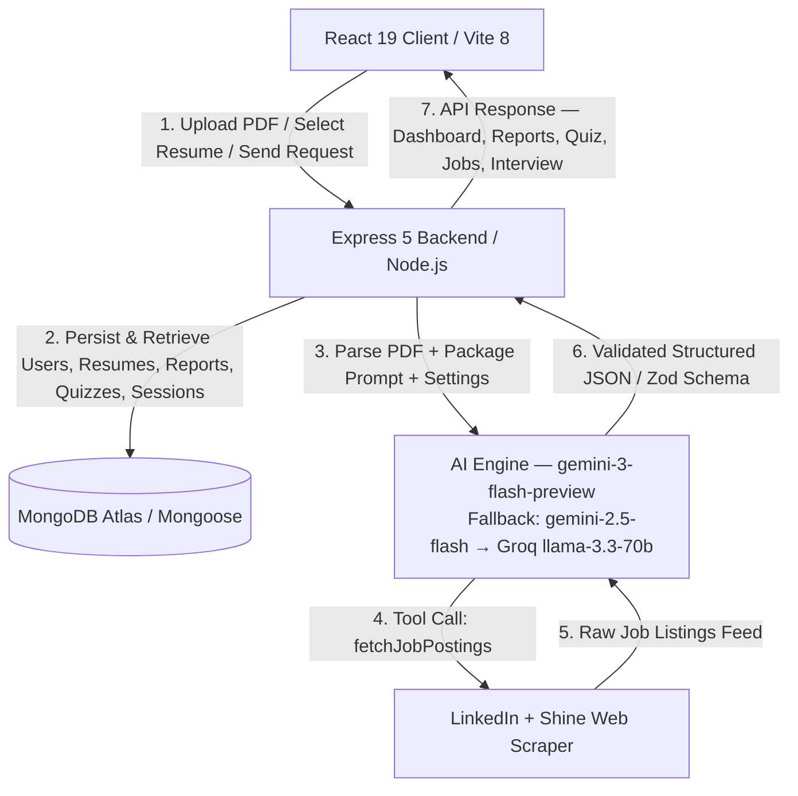
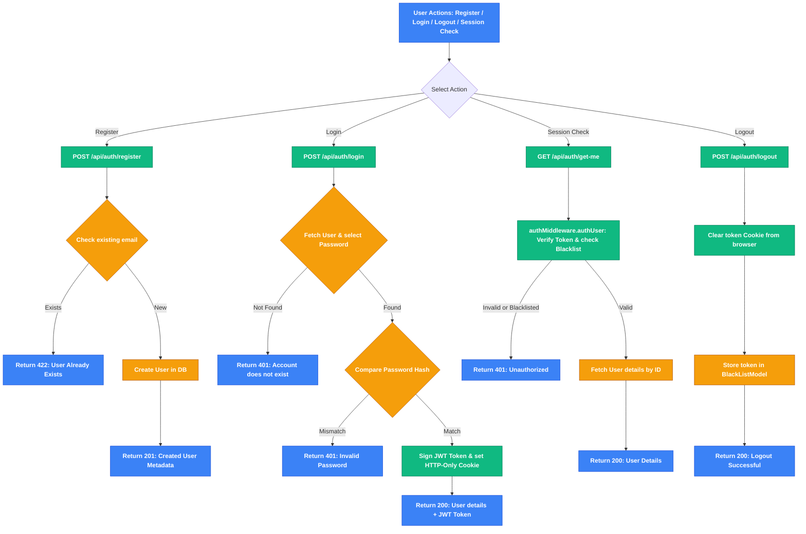
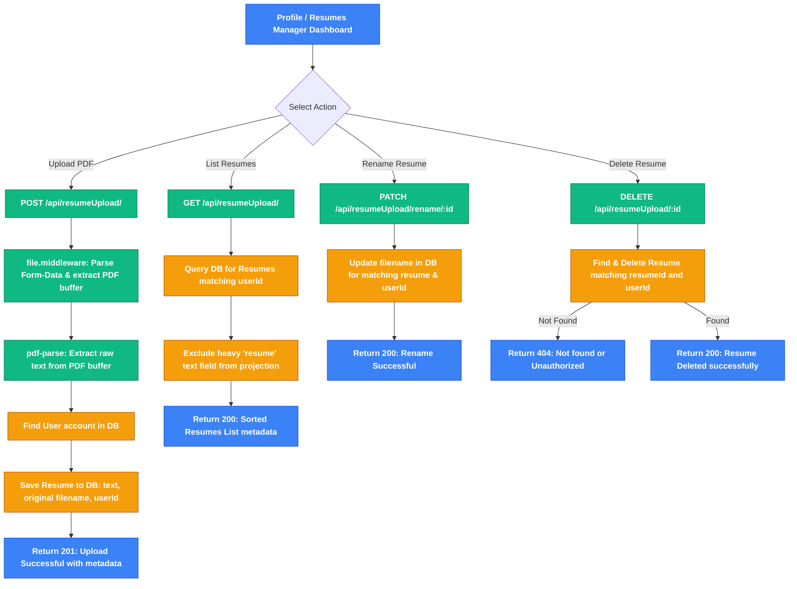
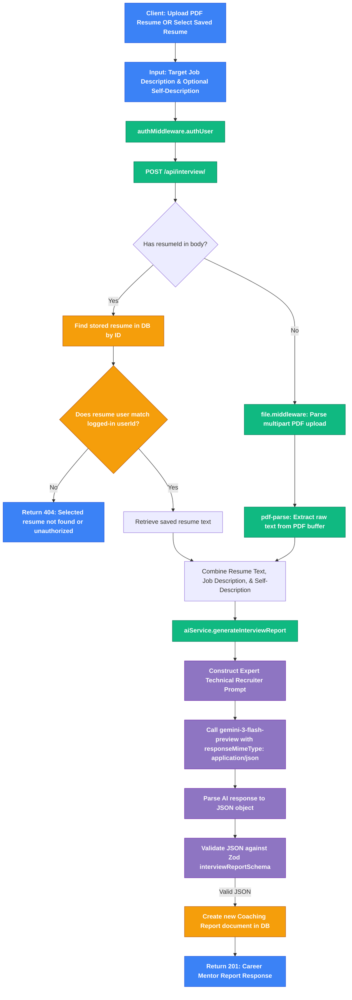
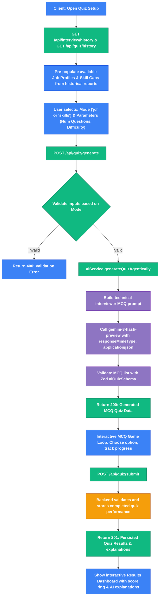
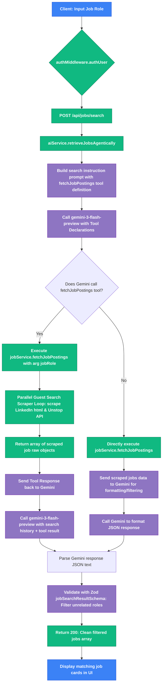
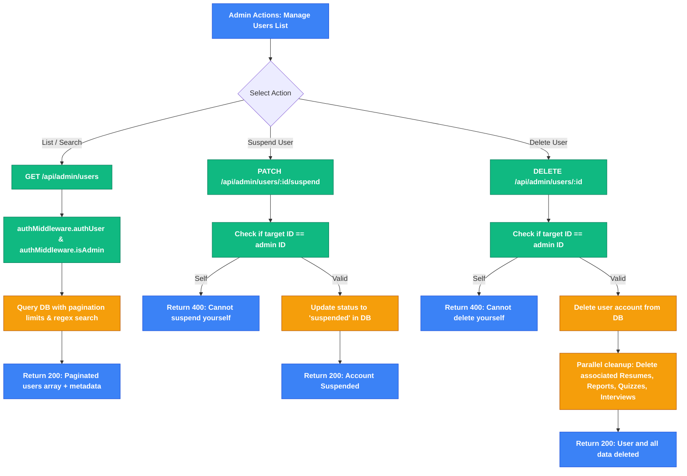
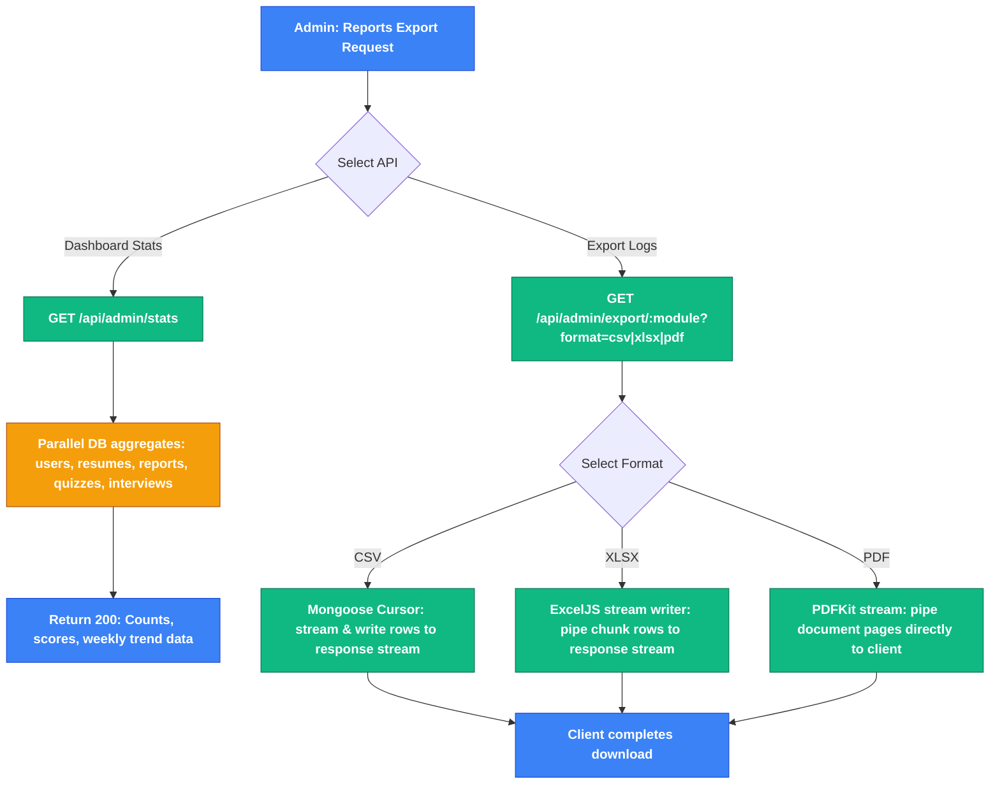
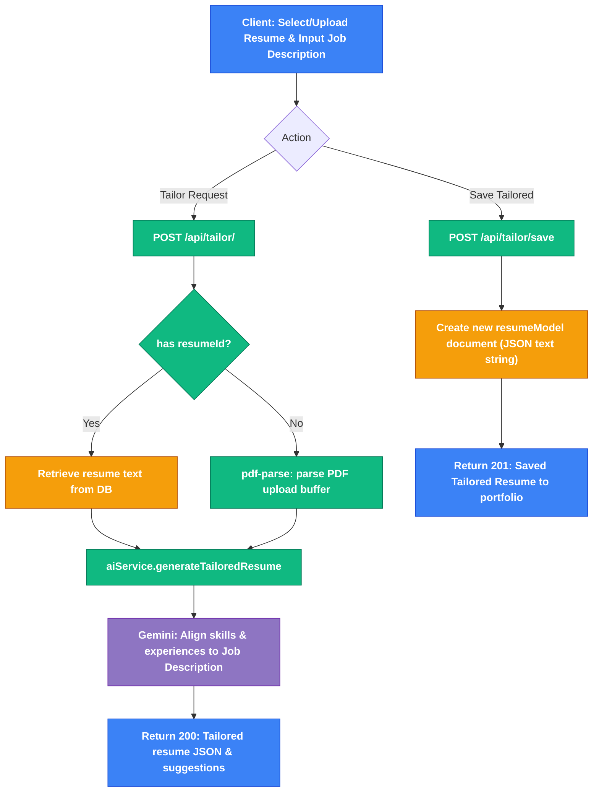
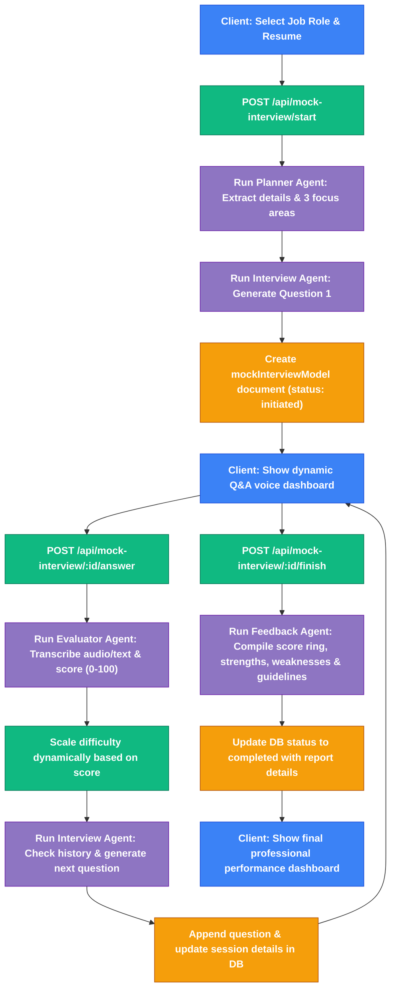

# 🚀 Neural Forge: Agentic AI Career Coach & Resume Mentor

<div align="center">


An advanced, end-to-end **Agentic AI-powered career coach** designed to automate resume feedback, tailor resumes, track professional skill gaps, generate custom timelines, run adaptive technical interview quizzes, support real-time voice conversational mock interviews, and fetch matching job listings using an intelligent scraping loop.

</div>

---

## 🗺️ System Architecture

The diagram below details the data flow and integration between the React 19 client, the Express 5 MERN backend, the AI engine, and all external services:



---

## ✨ Core Features

### 📁 Resume Portfolio & Profile Manager
* **In-Memory PDF Parser**: Converts PDF uploads into raw text structures instantly.
* **Resume Manager Collection**: Users can drag-and-drop multiple resumes to their profile.
* **Dropdown Selection**: Generated reports can target stored profile resumes, eliminating redundant uploads.
* **Resume Maintenance**: Full dashboard to view upload histories, rename resumes, and delete files dynamically.

### 🎯 AI Coaching Reports & Prep Roadmaps
* **Intelligent Match Score**: Instant alignment metrics (0-100%) against target job descriptions.
* **Mock Questions**: Returns 5-7 technical questions and 3-5 behavioral questions matching candidate-intent and answers.
* **Adaptive Timelines**: Dynamic preparation timelines that scale from 7 up to 30+ days based on skill gaps.
* **Learning Badges**: Clickable video resources (🎥 YouTube) and official reference pages (📄 documentation).

### ✂️ AI Resume Tailoring & Enhancer
* **Job Description Alignment**: Matches resume content against job descriptions, identifying key matches and highlights.
* **Tailored Resume Generation**: Generates refined markdown copies of professional experiences and qualifications.
* **Interactive Editing & Saving**: Users can edit generated resumes in the UI and save them directly back to their resume portfolio.

### 🧠 Adaptive Interview Prep Quizzes
* **Hybrid Scope Selectors**: Launch quizzes targeting either job description history or identified skill gaps.
* **Custom Parameter Bounds**: Supports custom numeric input count (1-30 questions) and difficulty levels.
* **MCQ Game Loop**: Interactive deck showing progress bars and immediate choice checkmarks.
* **Detailed AI Explanations**: Explains the correct answer logic with Gemini-backed explanations.
* **Performance Tracker**: Score logging and past quiz history persisted in MongoDB.

### 🎙️ Conversational Mock Interviews
* **Multi-Agent Orchestration**: Plan, interview, evaluate, and deliver comprehensive feedback via four dedicated AI agents.
* **Voice and Audio Integration**: Supports voice answers via audio upload, dynamically transcribing and scoring responses.
* **Adaptive Difficulty Scaling**: Real-time updates adjusting difficulty (Easy/Medium/Hard) based on cumulative performance grades.
* **Detailed Dashboard Reports**: Summarizes performance, overall/technical/communication scores, strengths, weaknesses, and key tips.

### 💼 Agentic Job Discovery
* **Scraper Tool Loops**: Uses Gemini function declarations to search LinkedIn and Unstop.
* **AI Relevance Filter**: Discards unrelated profiles and filters jobs matching the search query.

### 🛡️ Admin Portal Telemetry & Control
* **Admin Overview Dashboard**: Dynamic line chart of daily activity trends (parallel aggregation) and AI model distribution.
* **User Management System**: Admin controls to suspend, activate, inspect details, or delete users (cascade deletion).
* **AI Analytics Cost Auditor**: Real-time calculations of latency, success rates, token weights, and estimated billing.
* **Low-Memory Export Streams**: Streams large reports in CSV, XLSX workbook chunks, or formatted PDFs.

### 🔒 Dedicated Admin Profile
* **Role-Separated Profile Pages**: Admins get a purpose-built profile panel — separate from the user career profile — focused on account management, security, and login history.
* **Security Center**: Change password with live strength indicator, validation rules, and success/error feedback.
* **Login Activity Log**: Displays last login details (browser, OS, device, IP) and a scrollable table of the 5 most recent sessions.

---

## 📁 Repository Directory Structure

```text
├── backend/
│   ├── config/              # MongoDB ODM connections
│   ├── src/
│   │   ├── controllers/     # Auth, reports, resumes, quiz, tailoring, mock interviews, admin control
│   │   ├── middlewares/     # JWT authentication, role guards (isAdmin), multer upload
│   │   ├── models/          # Mongoose database schemas
│   │   ├── routes/          # Mounted endpoints
│   │   └── services/        # Gemini/Groq AI integrations, scraper methods, exports
│   ├── index.js             # Middleware configurations & routes binding
│   └── server.js            # Node HTTP server listener
└── frontend/
    ├── src/
    │   ├── components/      # UI components (Sidebar, Report Details, Profile sub-cards)
    │   ├── pages/           # Pages (Dashboard, Profile, Quiz, Search)
    │   │   ├── Dashboard.jsx
    │   │   ├── Profile.jsx            # User career profile
    │   │   ├── ResumeUpload.jsx
    │   │   ├── TailorResume.jsx       # AI Resume Tailoring Interface
    │   │   ├── Quiz.jsx               # Adaptive MCQ Prep Quizzes
    │   │   ├── MockInterview.jsx      # Voice Conversational Interview Board
    │   │   ├── JobSearch.jsx
    │   │   ├── Login.jsx / Register.jsx
    │   │   └── admin/                 # System Administration Dashboards:
    │   │       ├── AdminDashboard.jsx
    │   │       ├── AdminUsers.jsx
    │   │       ├── AdminAnalytics.jsx
    │   │       ├── AdminProfile.jsx   # Dedicated Admin Profile Panel
    │   │       └── AdminExport.jsx
    │   ├── App.jsx          # Route configurations
    │   ├── index.css        # Core custom HSL-based stylesheet
    │   └── main.jsx         # App bootstrap anchor
```

---

## ⚙️ Prerequisites & Environment Variables

Create a file named `.env` in the `backend` directory:

```env
# MongoDB Connection URI (Local database or Atlas Cluster)
mongo_uri=mongodb://localhost:27017/agentic-ai-resume

# Google Gemini API credential (used for text processing & agent flows)
GOOGLE_GEMINI_API_KEY=your_gemini_api_key_here

# Groq API key (used for high-speed conversational mock interview agent loops)
GROQ_API_KEY=your_groq_api_key_here

# JWT Secret key for authentication token hashing
jwt_secret=your_super_secret_jwt_key_here
```

---

## 🚀 Getting Started

Follow these steps to set up and run the application locally:

### 1. Start the Backend API
Navigate to the `backend` folder, install npm packages, and start the development server:
```bash
cd backend
npm install
npm start
```
*(The backend server will connect to MongoDB and start listening on port `3000`)*

### 2. Start the Frontend Client
Open a new terminal window, navigate to the `frontend` folder, install npm packages, and launch Vite:
```bash
cd frontend
npm install
npm run dev
```
*(The client application will start running on port `5173`)*

---

## 🔌 Core API Specifications

| Method | Endpoint | Description | Auth Required |
| :--- | :--- | :--- | :--- |
| **POST** | `/api/auth/register` | Registers a new user account | No |
| **POST** | `/api/auth/login` | Authenticates user and sets token cookie | No |
| **GET** | `/api/auth/get-me` | Validates session token and returns credentials | Yes |
| **POST** | `/api/auth/logout` | Clears local cookie and blacklists token | Yes |
| **PUT** | `/api/auth/profile` | Updates authenticated user name and email | Yes |
| **PUT** | `/api/auth/profile/change-password` | Changes the authenticated user's password | Yes |
| **GET** | `/api/auth/profile/login-history` | Retrieves the user's session login history | Yes |
| **POST** | `/api/interview/` | Generates a career report from parsed PDF upload or stored resume | Yes |
| **GET** | `/api/interview/history` | Fetches historical reports generated by user | Yes |
| **GET** | `/api/resumeUpload/` | Lists metadata of user's stored resumes | Yes |
| **POST** | `/api/resumeUpload/` | Uploads and saves a new resume to profile | Yes |
| **DELETE**| `/api/resumeUpload/:id` | Deletes a stored resume from database | Yes |
| **PATCH** | `/api/resumeUpload/rename/:id` | Renames an existing stored resume file | Yes |
| **POST** | `/api/quiz/generate` | Generates custom multiple-choice quiz questions | Yes |
| **POST** | `/api/quiz/submit` | Grades and saves the completed quiz score | Yes |
| **GET** | `/api/quiz/history` | Retrieves the history of completed quizzes | Yes |
| **POST** | `/api/jobs/search` | Scrapes public search opportunities agentically | Yes |
| **POST** | `/api/tailor/` | Generates a tailored resume alignment against a job description | Yes |
| **POST** | `/api/tailor/save` | Saves edited tailored resume back to profile resumes list | Yes |
| **POST** | `/api/mock-interview/start` | Initializes a conversational mock interview and generates Q1 | Yes |
| **POST** | `/api/mock-interview/:id/answer` | Evaluates question response (text/audio) and returns next question | Yes |
| **POST** | `/api/mock-interview/:id/finish` | Compiles session transcript and outputs final evaluation report | Yes |
| **GET** | `/api/mock-interview/history` | Fetches history of completed conversational mock interviews | Yes |
| **GET** | `/api/mock-interview/:id` | Retrieves full details of a specific interview session | Yes |
| **GET** | `/api/admin/stats` | Fetches overall telemetry statistics & daily engagement trend | Yes (Admin) |
| **GET** | `/api/admin/analytics` | Fetches aggregated AI request counts, success rate, and costs | Yes (Admin) |
| **GET** | `/api/admin/users` | Retrieves paginated search results of registered user accounts | Yes (Admin) |
| **GET** | `/api/admin/users/:id` | Retrieves detailed information for a specific user profile | Yes (Admin) |
| **PATCH** | `/api/admin/users/:id/suspend` | Suspends user profile (locks session) | Yes (Admin) |
| **PATCH** | `/api/admin/users/:id/activate` | Re-activates a suspended user profile | Yes (Admin) |
| **DELETE**| `/api/admin/users/:id` | Cascades delete user and all resumes/reports/logs | Yes (Admin) |
| **GET** | `/api/admin/export/users` | Streams registered users table as CSV, Excel, or PDF | Yes (Admin) |
| **GET** | `/api/admin/export/ats` | Streams resume matching reports as CSV, Excel, or PDF | Yes (Admin) |
| **GET** | `/api/admin/export/interviews` | Streams mock interview lists as CSV, Excel, or PDF | Yes (Admin) |
| **GET** | `/api/admin/export/analytics` | Streams AI request telemetry as CSV, Excel, or PDF | Yes (Admin) |

---

## 🔄 Detailed Feature & API Workflows

This section details the step-by-step execution flow for every application feature and API request, complete with interactive Mermaid diagrams mapping frontend triggers directly to backend controllers, MongoDB schemas, and the Google Gemini/Groq AI loops.

### 🔑 1. User Authentication Flow
Handles registering accounts, logging in, managing browser cookies/session validation, and handling secure sign-out.

#### 🛠️ Files Involved:
* **Routes**: [user.routes.js](file:///c:/Users/mibni/OneDrive/Desktop/GenAI-Resume/backend/src/routes/user.routes.js)
* **Controller**: [user.controller.js](file:///c:/Users/mibni/OneDrive/Desktop/GenAI-Resume/backend/src/controllers/user.controller.js)
* **Model**: [user.models.js](file:///c:/Users/mibni/OneDrive/Desktop/GenAI-Resume/backend/src/models/user.models.js)
* **Auth Guard Middleware**: [auth.middleware.js](file:///c:/Users/mibni/OneDrive/Desktop/GenAI-Resume/backend/src/middlewares/auth.middleware.js)

#### 📝 Step-by-Step Flow:
1. **Registration**: 
   * Client sends a `POST` request to `/api/auth/register` with `name`, `email`, and `password`.
   * The backend validates if the email is already registered using [userModel.findOne()](file:///c:/Users/mibni/OneDrive/Desktop/GenAI-Resume/backend/src/controllers/user.controller.js#L9).
   * If not registered, [userModel.create()](file:///c:/Users/mibni/OneDrive/Desktop/GenAI-Resume/backend/src/controllers/user.controller.js#L18) inserts a new document. A database pre-save hook automatically hashes the password using `bcrypt` (10 rounds).
2. **Login**: 
   * Client sends a `POST` request to `/api/auth/login` with credentials.
   * Backend retrieves the user by email including the password hash.
   * `bcrypt.compare()` checks credentials.
   * On success, a JWT is signed with `userId` and a cookie named `token` is set with a 2-hour expiration.
3. **Session Check**:
   * On application mount, Vite sends a `GET` request to `/api/auth/get-me`.
   * The `authUser` middleware intercepts, checks/verifies the token, and loads user info.
4. **Logout**:
   * Client sends a `POST` request to `/api/auth/logout`.
   * The backend clears the `token` cookie and registers the JWT inside `BlackListModel` to blacklist the token.



---

### 📁 2. Resume Portfolio & Profile Manager Flow
Users can upload, persist, view, and delete multiple resumes in their profile page to build a career portfolio.

#### 🛠️ Files Involved:
* **Routes**: [resumeUpload.routes.js](file:///c:/Users/mibni/OneDrive/Desktop/GenAI-Resume/backend/src/routes/resumeUpload.routes.js)
* **Controller**: [resumeUpload.controller.js](file:///c:/Users/mibni/OneDrive/Desktop/GenAI-Resume/backend/src/controllers/resumeUpload.controller.js)
* **Model**: [resume.model.js](file:///c:/Users/mibni/OneDrive/Desktop/GenAI-Resume/backend/src/models/resume.model.js)
* **File Middleware**: [file.middleware.js](file:///c:/Users/mibni/OneDrive/Desktop/GenAI-Resume/backend/src/middlewares/file.middleware.js) (Multer configuration)

#### 📝 Step-by-Step Flow:
1. **Upload**:
   * React client posts a multipart `FormData` object containing the `.pdf` file to `POST /api/resumeUpload/`.
   * Multer intercepts the file buffer in memory.
   * `pdf-parse` extracts raw text from the parsed buffer immediately.
   * A document containing the filename, parsed text contents, and associated `userId` is saved in the `Resume` collection via [resumeUpload()](file:///c:/Users/mibni/OneDrive/Desktop/GenAI-Resume/backend/src/controllers/resumeUpload.controller.js#L26).
2. **List Resumes**:
   * React client fetches saved resumes using `GET /api/resumeUpload/`.
   * Backend queries MongoDB matching `userId` and projects `-resume` to exclude the heavy parsed text field, ensuring fast payloads.
3. **Rename Resume**:
   * React client requests `PATCH /api/resumeUpload/rename/:id` containing `newName`.
   * Backend updates the filename of the matching resume owned by the active user.
4. **Delete**:
   * Client calls `DELETE /api/resumeUpload/:id`.
   * Backend performs a secure delete check ([deleteUserResume](file:///c:/Users/mibni/OneDrive/Desktop/GenAI-Resume/backend/src/controllers/resumeUpload.controller.js#L77)) validating both the `_id` and owner `user` fields match the request context.



---

### 🎯 3. AI Coaching Reports & Prep Roadmaps Flow
Analyzes candidate details, parsed resumes, and job roles to draft actionable career roadmaps and prep reports.

#### 🛠️ Files Involved:
* **Routes**: [interview.routes.js](file:///c:/Users/mibni/OneDrive/Desktop/GenAI-Resume/backend/src/routes/interview.routes.js)
* **Controller**: [interview.controller.js](file:///c:/Users/mibni/OneDrive/Desktop/GenAI-Resume/backend/src/controllers/interview.controller.js)
* **AI Service**: [ai.services.js](file:///c:/Users/mibni/OneDrive/Desktop/GenAI-Resume/backend/src/services/ai.services.js) (LLM Prompt & validation)
* **Model**: [interviewReportModel.js](file:///c:/Users/mibni/OneDrive/Desktop/GenAI-Resume/backend/src/models/interviewReportModel.js)

#### 📝 Step-by-Step Flow:
1. **Trigger Report Generation**:
   * Client posts data to `POST /api/interview/`.
   * **Source Select Option**: If `resumeId` is present, the backend queries the database for the resume's text. If a new file is uploaded, `pdf-parse` extracts the text on-the-fly.
2. **AI Analysis**:
   * The text, job description, and optional self-description are packaged and dispatched to [generateInterviewReport()](file:///c:/Users/mibni/OneDrive/Desktop/GenAI-Resume/backend/src/services/ai.services.js#L52).
   * Gemini (`gemini-3-flash-preview` with a fallback to `gemini-2.5-flash`) builds a structured career report matching `interviewReportSchema` rules.
3. **Structured Validation**:
   * Gemini returns a JSON object.
   * `Zod` validation parses and verifies the JSON structure.
   * The response is saved in the database under the user's account and returned to the client to render visual scores, timelines, and reference links.



---

### 🧠 4. Adaptive Interview Prep Quizzes Flow
Enables interactive game-loop testing based on specific skill gaps or target job profiles.

#### 🛠️ Files Involved:
* **Routes**: [quiz.routes.js](file:///c:/Users/mibni/OneDrive/Desktop/GenAI-Resume/backend/src/routes/quiz.routes.js)
* **Controller**: [quiz.controller.js](file:///c:/Users/mibni/OneDrive/Desktop/GenAI-Resume/backend/src/controllers/quiz.controller.js)
* **AI Service**: [ai.services.js](file:///c:/Users/mibni/OneDrive/Desktop/GenAI-Resume/backend/src/services/ai.services.js) (`generateQuizAgentically`)
* **Model**: [quiz.model.js](file:///c:/Users/mibni/OneDrive/Desktop/GenAI-Resume/backend/src/models/quiz.model.js)

#### 📝 Step-by-Step Flow:
1. **Initialize Setup**:
   * React calls `GET /api/interview/history` and `GET /api/quiz/history` to pre-populate setup fields with previous job profile titles and identified skill gaps.
2. **Generate Questions**:
   * User posts options (mode, question count, difficulty, target skills or job description) to `POST /api/quiz/generate`.
   * Backend forwards the data to `generateQuizAgentically`.
   * Gemini compiles customized MCQs with exactly 4 options, a correct answer string, and detailed explanations, which are validated by `aiQuizSchema` (Zod) and returned.
3. **Gameplay & Submission**:
   * React displays the interactive quiz questions in a deck-based UI with active progress bars.
   * On final click, answers are graded on-the-fly, and the results are sent via `POST /api/quiz/submit` to save the performance details in MongoDB.



---

### 💼 5. Agentic Job Discovery Flow
Orchestrates an intelligent scraping loop utilizing Google Gemini function declarations to look up job postings on LinkedIn and Unstop.

#### 🛠️ Files Involved:
* **Routes**: [job.routes.js](file:///c:/Users/mibni/OneDrive/Desktop/GenAI-Resume/backend/src/routes/job.routes.js)
* **Controller**: [job.controller.js](file:///c:/Users/mibni/OneDrive/Desktop/GenAI-Resume/backend/src/controllers/job.controller.js)
* **AI Service**: [ai.services.js](file:///c:/Users/mibni/OneDrive/Desktop/GenAI-Resume/backend/src/services/ai.services.js) (`retrieveJobsAgentically`)
* **Scraper Service**: [job.service.js](file:///c:/Users/mibni/OneDrive/Desktop/GenAI-Resume/backend/src/services/job.service.js)

#### 📝 Step-by-Step Flow:
1. **Search Request**:
   * Client posts the search query to `POST /api/jobs/search` with `{ jobRole }`.
2. **Gemini Agentic Tool Trigger**:
   * `retrieveJobsAgentically` sends a prompt specifying the tool definition of `fetchJobPostings` to Gemini.
   * Gemini interprets the intent and responds requesting the execution of the `fetchJobPostings` function with parameters.
3. **Execution Loop**:
   * The backend captures this function call and executes `jobService.fetchJobPostings(jobRole)`.
   * **LinkedIn Guest Scraper**: Runs a request to public Guest Search and extracts listing tags using customized regex match patterns.
   * **Unstop Scraper**: Queries Unstop's search APIs in parallel.
   * The gathered listings are compiled into a raw array and sent back to Gemini.
4. **Relevance Filter & Format**:
   * Gemini analyzes the raw results, filters out any unrelated postings, and structures the response into a validated JSON layout conforming to `jobSearchResultSchema` (Zod), which is then sent to the client.



---

### 🛡️ 6. Admin Management & Access Control Flow
Allows administrators to inspect system registrations, activate/suspend user access, and cascade-delete profiles securely.

#### 🛠️ Files Involved:
* **Routes**: [userManagement.routes.js](file:///c:/Users/mibni/OneDrive/Desktop/GenAI-Resume/backend/src/routes/userManagement.routes.js)
* **Controller**: [userManagement.controller.js](file:///c:/Users/mibni/OneDrive/Desktop/GenAI-Resume/backend/src/controllers/userManagement.controller.js)
* **Service**: [userManagement.service.js](file:///c:/Users/mibni/OneDrive/Desktop/GenAI-Resume/backend/src/services/userManagement.service.js)
* **Auth Middleware**: [auth.middleware.js](file:///c:/Users/mibni/OneDrive/Desktop/GenAI-Resume/backend/src/middlewares/auth.middleware.js) (`isAdmin` role guard)

#### 📝 Step-by-Step Flow:
1. **Admin Authorization Check**:
   * The `authUser` middleware decodes the JWT token.
   * The `isAdmin` middleware loads the user from the database and checks if `user.role === 'admin'`. If not, it rejects the request with a 403 Forbidden.
2. **List & Search**:
   * Admin opens `/admin/users` which calls `GET /api/admin/users?page=1&limit=10&search=john`.
   * `getUsers()` matches name/email case-insensitively, applies limits/skip values, and counts matches concurrently.
3. **Suspend/Activate**:
   * Admin triggers status toggles, requesting `PATCH /api/admin/users/:id/suspend` or `/activate`.
   * The controller prevents self-suspension by checking if the target ID matches the logged-in admin ID.
   * Status is updated to `suspended` or `active` in the collection.
4. **Cascade Delete**:
   * Admin calls `DELETE /api/admin/users/:id`.
   * The controller enforces a safety guard preventing admin self-deletion.
   * On validation, user is permanently deleted along with parallel deletions for all associated Resumes, Interview Reports, Mock Interviews, Quizzes, and Job Searches.



---

### 📊 7. Telemetry Monitoring & Streaming Exports Flow
Calculates parallel stats aggregates and streams massive log exports with low memory footprints.

#### 🛠️ Files Involved:
* **Routes**: [export.routes.js](file:///c:/Users/mibni/OneDrive/Desktop/AGENTIC%20AI/backend/src/routes/export.routes.js), [dashboard.routes.js](file:///c:/Users/mibni/OneDrive/Desktop/AGENTIC%20AI/backend/src/routes/dashboard.routes.js), [aiAnalytics.routes.js](file:///c:/Users/mibni/OneDrive/Desktop/AGENTIC%20AI/backend/src/routes/aiAnalytics.routes.js)
* **Controller**: [export.controller.js](file:///c:/Users/mibni/OneDrive/Desktop/AGENTIC%20AI/backend/src/controllers/export.controller.js), [dashboard.controller.js](file:///c:/Users/mibni/OneDrive/Desktop/AGENTIC%20AI/backend/src/controllers/dashboard.controller.js), [aiAnalytics.controller.js](file:///c:/Users/mibni/OneDrive/Desktop/AGENTIC%20AI/backend/src/controllers/aiAnalytics.controller.js)
* **Service**: [export.service.js](file:///c:/Users/mibni/OneDrive/Desktop/AGENTIC%20AI/backend/src/services/export.service.js), [dashboard.service.js](file:///c:/Users/mibni/OneDrive/Desktop/AGENTIC%20AI/backend/src/services/dashboard.service.js), [aiAnalytics.service.js](file:///c:/Users/mibni/OneDrive/Desktop/AGENTIC%20AI/backend/src/services/aiAnalytics.service.js)

#### 📝 Step-by-Step Flow:
1. **Parallel Aggregation**:
   * `GET /api/admin/stats` triggers `getDashboardStats()`. It runs concurrent aggregates on 5 models to fetch counts, scores, and weekly growth alongside the last 7 days of daily activity.
2. **Low-Memory Export Streams**:
   * Admin requests file downloads via `/api/admin/export/:module?format=csv|xlsx|pdf`.
   * **CSV Mode**: Uses a Mongoose cursor to pipe and write matching records row-by-row directly to the Express output stream, maintaining a constant memory profile.
   * **Excel Mode**: Initializes a streaming workbook writer (`ExcelJS.stream.xlsx.WorkbookWriter`) to pipe workbook parts dynamically.
   * **PDF Mode**: Directs a `PDFKit` document stream, rendering professional summaries, metadata headers, and formatted tables page-by-page.



---

### ✂️ 8. AI Resume Tailoring Flow
Analyzes the uploaded resume or stored resume and tailors it specifically to align with target job requirements, allowing users to tweak it and persist the tailored copy.

#### 🛠️ Files Involved:
* **Routes**: [tailor.routes.js](file:///c:/Users/mibni/OneDrive/Desktop/GenAI-Resume/backend/src/routes/tailor.routes.js)
* **Controller**: [tailor.controller.js](file:///c:/Users/mibni/OneDrive/Desktop/GenAI-Resume/backend/src/controllers/tailor.controller.js)
* **AI Service**: [ai.services.js](file:///c:/Users/mibni/OneDrive/Desktop/GenAI-Resume/backend/src/services/ai.services.js) (`generateTailoredResume`)
* **Model**: [resume.model.js](file:///c:/Users/mibni/OneDrive/Desktop/GenAI-Resume/backend/src/models/resume.model.js)

#### 📝 Step-by-Step Flow:
1. **Tailor Request**:
   * Client posts the tailoring request to `POST /api/tailor/` with a target `jobDescription`.
   * **Source Select Option**: If `resumeId` is present, the backend queries MongoDB for the resume text. Otherwise, a PDF file is uploaded via Multer, and `pdf-parse` extracts the text dynamically.
2. **AI Resume Tailoring**:
   * The backend forwards the details to `aiService.generateTailoredResume()`.
   * Gemini analyzes the resume against the target description and structures a tailored copy (optimizing highlights, summary, experience, and project matches) alongside actionable suggestions.
3. **Save Tailored Resume**:
   * The client renders an editor. When the user saves the tailored resume, a `POST` request is sent to `/api/tailor/save` with the `editedData` (JSON) and custom `resumeName`.
   * The backend persists it inside `resumeModel` with a `[Tailored] ` prefix.



---

### 🎙️ 9. Conversational Mock Interviews Flow
Implements voice-capable conversational mock interviews using a sequential multi-agent architecture with adaptive difficulty scaling.

#### 🛠️ Files Involved:
* **Routes**: [mockInterview.routes.js](file:///c:/Users/mibni/OneDrive/Desktop/GenAI-Resume/backend/src/routes/mockInterview.routes.js)
* **Controller**: [mockInterview.controller.js](file:///c:/Users/mibni/OneDrive/Desktop/GenAI-Resume/backend/src/controllers/mockInterview.controller.js)
* **Agents Service**: [mockInterview.services.js](file:///c:/Users/mibni/OneDrive/Desktop/GenAI-Resume/backend/src/services/mockInterview.services.js) (`runPlannerAgent`, `runInterviewAgent`, `runEvaluatorAgent`, `runFeedbackAgent`)
* **Model**: [mockInterview.model.js](file:///c:/Users/mibni/OneDrive/Desktop/GenAI-Resume/backend/src/models/mockInterview.model.js), [resume.model.js](file:///c:/Users/mibni/OneDrive/Desktop/GenAI-Resume/backend/src/models/resume.model.js)

#### 📝 Step-by-Step Flow:
1. **Initiate Session**:
   * Client posts `jobRole`, optional `resumeId`, and `difficulty` to `POST /api/mock-interview/start`.
   * **Planner Agent**: Parses the target role and resume to identify exactly 3 core technical focus areas.
   * **Interview Agent**: Generates the first technical question targeting focal area 1.
   * The backend saves a new `MockInterview` session document in MongoDB and returns the session details with Question 1.
2. **Dynamic Q&A Loop**:
   * The user answers the question. The response can be submitted as text or as a recorded audio file (captured in `multipart/form-data` under the `audio` name).
   * **Evaluator Agent**: Evaluates the answer. If audio is uploaded, it transcribes the speech first. It scores the user (0-100), offers constructive feedback, and generates an ideal reference answer.
   * **Adaptive Difficulty**: If the score is $\ge 80$, the session difficulty increments (e.g. Easy $\to$ Medium). If the score is $< 60$, it drops.
   * **Interview Agent**: Generates the next question by analyzing the transcript history and focus areas.
   * The backend updates the database and returns the evaluation and Question 2.
3. **Session Finish & Report**:
   * The user clicks "Finish Interview". Client sends a `POST` request to `/api/mock-interview/:id/finish`.
   * **Feedback Agent**: Processes the entire interview history. It calculates overall performance scores, technical/communication grades, highlights strengths/weaknesses, lists lacking skills, and proposes study recommendations.
   * The backend sets status to `"completed"` and persists the feedback report.


